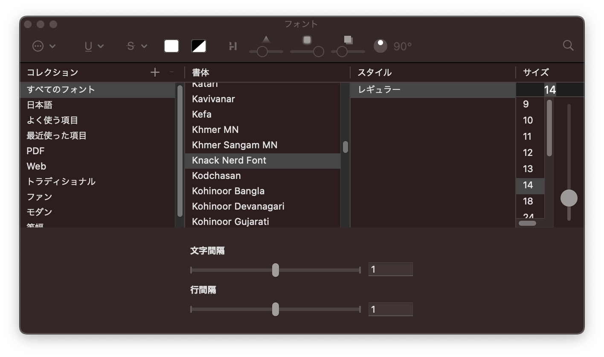
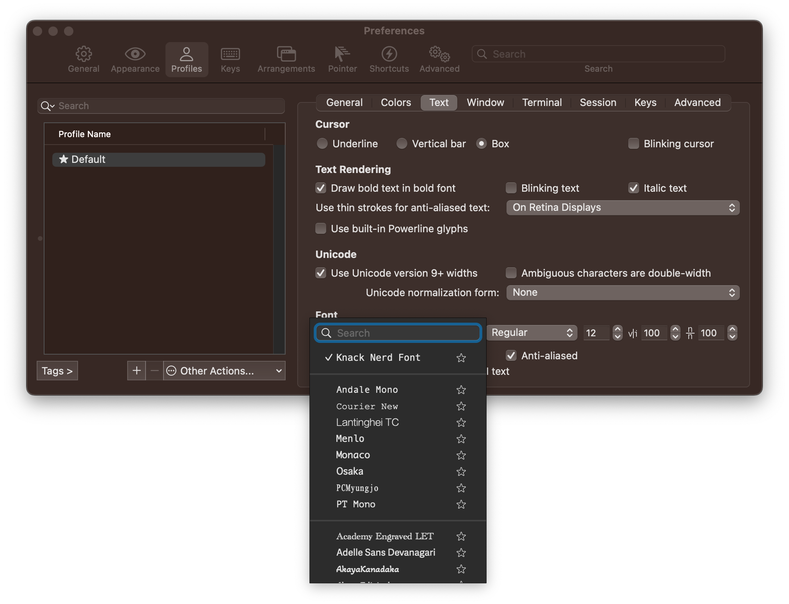

# dotfiles


## 特徴

- MacOS と Ubuntu の環境を想定しています。
- Docker 内の dotfiles としての利用も想定しています。
- `$HOME`以下のみの変更に抑えることも可能です。

## インストール

```sh
git clone https://github.com/atahatah/dotfiles.git $HOME/dotfiles
cd $HOME/dotfiles
make install
```

### フォントの設定

- VSCode(MacOS/Ubuntu 22.04)
  `editor.fontFamily`に、`Knack Nerd Font`を追加。

- Terminal(MacOS)
  `Terminal`を開き、`Cmd+,`でプロファイルを開き、フォントを次のように`Knack Nerd Font`に変更する。
  

- iTerm2(MacOS)
  `iTerm2`を開き、`Cmd+,`でプロファイルを開き、フォントを次のように`Knack Nerd Font`に変更する。
  

### ローカルにインストール

`$HOME`以下のみの変更に抑えます。ただし、MacOS の場合、`Homebrew`とそれによる dependencies のインストールが抑制されます。このインストール方法は、どちらかというと Linux 環境を想定しています。

```sh
git clone https://github.com/atahatah/dotfiles.git $HOME/dotfiles
cd $HOME/dotfiles
make install_locally
```

## 更新

zsh プラグインなどの更新の実行
ただし、`make install_locally`によりローカルに保存された場合は正常な動作を保証しません。

```sh
cd $HOME/dotfiles
make update
```

## テスト

Docker を使ってテストすることが可能です。

### 立ち上げる

```sh
cd path/to/dir
docker compose up -d
docker compose exec dotfiles zsh
```

### 後片付け

```sh
docker compose down
```

### その他

NVIDIA Driver が壊れた場合の再インストールは[こちら](ref/nvidia.md)。

## 参考

[ようこそ dotfiles の世界へ](https://qiita.com/yutkat/items/c6c7584d9795799ee164)

[Mac の環境を dotfiles でセットアップしてみた](https://dev.classmethod.jp/articles/joined-mac-dotfiles-customize/)

[makefile での OS 条件分岐](https://qiita.com/minoruGH/items/424c3d61cfe725dc2620)

[dotfiles 整理 その 1：zsh の構成を見なおそう](https://kitakitabauer.hatenablog.com/entry/2016/09/13/173456)

[.zshrc を色んな環境で共有する方法を考えてみた](https://qiita.com/catatsuy/items/00ebf78f56960b6d43c2)

[ワンライナーで dotfiles をインストールする](https://kisqragi.hatenablog.com/entry/2020/02/17/224129)

[linux インストールからの環境構築を自動化する](https://qiita.com/aki-f/items/494cefe0e98cc74249fa)

[高速で設定しやすい Zsh/Bash プラグインマネージャー Sheldon の紹介](https://zenn.dev/ganta/articles/e1e0746136ce67)

[Mac の環境を dotfiles でセットアップしてみた](https://dev.classmethod.jp/articles/joined-mac-dotfiles-customize/)

[実行したコマンドの終了コードを表示する](https://qiita.com/takayuki206/items/f4d0dbb45e5ee2ee698e)

[nerd-fonts/readme_ja.md](https://github.com/ryanoasis/nerd-fonts/blob/master/readme_ja.md#font-patcher)

[ローカルにあるフォントを調べる](https://zenn.dev/sqer/articles/15219df9fab18d)

[dotfiles の更新忘れを防いで継続的に管理していく 🔧 💪](https://korosuke613.hatenablog.com/entry/2021/05/23/mydotfiles)

[シェルスクリプトの echo で”問題なく”色をつける(bash 他対応)](https://qiita.com/ko1nksm/items/095bdb8f0eca6d327233)

[tmux(with macOS)でマウススクロールを有効にする](https://zenn.dev/softoika/scraps/19abddeaa09e12)
