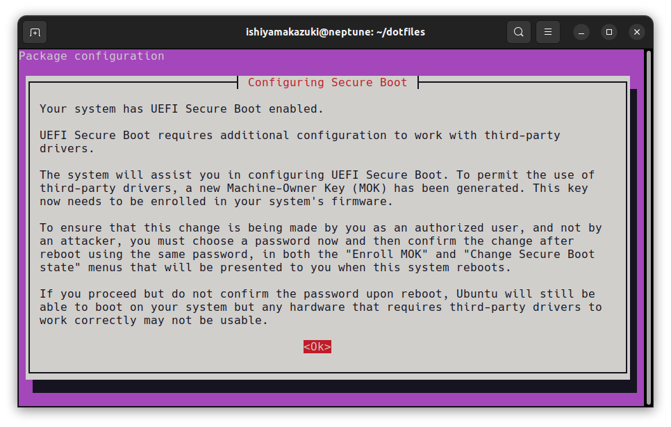
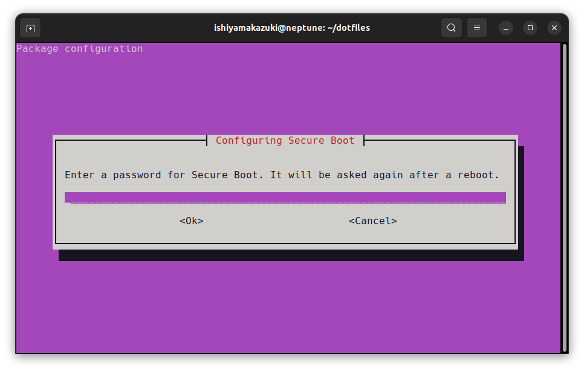

# Install For ML
実際に打ったコマンドを羅列していますが、変更される可能性があるので必ず参照元を確認してください。
## Install CUDA Toolkit and Driver

1. [ここ](https://developer.nvidia.com/cuda-downloads)にしたがってNVIDIA Driverをインストール
2. cuda-driversをインストールするためのコマンドを入力すると次の画面が表示される。 



スペースを押し次の画面でパスワードを入力する。(後でもう１度入力するもの)



3. PCを再起動する。
```sh
sudo reboot
```
4. PCの起動中に青い画面で4つほど選択肢を提示されるので、`Enroll MOK`を選び先程入力したパスワードを入力する。
5. NVIDIA Driverが入ったか確認する。
```sh
nvidia-smi
```


## Install Docker

1. Dockerのインストールは[こちら](https://docs.docker.com/engine/install/ubuntu/#install-using-the-repository)
```sh
# Add Docker's official GPG key:
sudo apt-get update
sudo apt-get install ca-certificates curl gnupg
sudo install -m 0755 -d /etc/apt/keyrings
curl -fsSL https://download.docker.com/linux/ubuntu/gpg | sudo gpg --dearmor -o /etc/apt/keyrings/docker.gpg
sudo chmod a+r /etc/apt/keyrings/docker.gpg

# Add the repository to Apt sources:
echo \
  "deb [arch="$(dpkg --print-architecture)" signed-by=/etc/apt/keyrings/docker.gpg] https://download.docker.com/linux/ubuntu \
  "$(. /etc/os-release && echo "$VERSION_CODENAME")" stable" | \
  sudo tee /etc/apt/sources.list.d/docker.list > /dev/null
sudo apt-get update
```
```sh
sudo apt-get install docker-ce docker-ce-cli containerd.io docker-buildx-plugin docker-compose-plugin
```
```sh
sudo docker run hello-world
```

2. sudoなしで`docker`

[こちら](https://qiita.com/DQNEO/items/da5df074c48b012152ee)より引用
```sh
sudo gpasswd -a $USER docker && sudo systemctl restart docker && exit
```
もう一度ログインすると`sudo`なしで`docker`が起動する。
```sh
docker run hello-world
```

3. NVIDIA Dockerのインストール

[ここ](nvidia.md#nvidia-docker-のインストール)を参照

## GitHubにsshを通す
1. keyを作る
```sh
ssh-keygen -t ed25519 -f ~/.ssh/github
```
2. sshのconfigを書き直す
```sh
vi $HOME/.ssh/config
```
```
Host github github.com
	HostName github.com
	IdentityFile ~/.ssh/github
	User git
```
3. 確認
```sh
ssh -T github
```
4. [GitHub](https://github.com/settings/keys)に公開鍵を保存する。
```sh
cat ~/.ssh/github.pub
```
